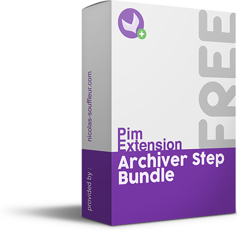

ArchiverStepBundle
==========================

Plug this step to a connector and manage by yourself where to stock the imported files.
To make it easier for you, the connector will create a directory everyday to organize the files. 
You can also use it as a product import job.

## Requirements

| ArchiverStepBundle     | Akeneo PIM Community Edition | Akeneo PIM Enterprise Edition |
|:------------------------------:|:----------------------------:|:-----------------------------:|
| v1.0.*                         | v3.*                         | v3.*                              |

## Installation

Enter the following command line:
```console
$php composer.phar require "nicolas-souffleur/archiver-step-bundle":"1.0.*"
```

Then enable the bundle in the ```app/AppKernel.php``` file in the registerProjectBundles() method:
```php
$bundles[] = new \Extensions\Bundle\ArchiverStepBundle\ExtensionsArchiverStepBundle()
```

## Usage

Two ways are possible :
* Use it as a product import job directly 
* Plug it to another connector 

### As a product import job 
* It's easy, go to the Import Profiles Management page and click on "Create Import Profile" 
* Then, select the 'CSV Product Import with Archiver Step' profile. 
* Configure it like a classic product import job.
* In the field "Archives directory path" configure the directory where you want to archive your files.

### Plug it to a connector
* In the jobs.yml file of your own connector, add the Archiver Step like as follow : 
```yml
extensions.archiver_step.job.archiver_import_job:
        class: '%pim_connector.job.simple_job.class%'
        arguments:
            - '%extensions_archiver_step.job_name.csv_product_import_archiver%'
            - '@event_dispatcher'
            - '@akeneo_batch.job_repository'
            -
                - '@pim_connector.step.csv_product.import'
                ## Add the following line
                - '@extensions_archiver_step.step.archiver'
```
* In your JobParameters file, add those two functions to add the dirArchive field to your configuration : 
```php
/**
     * {@inheritdoc}
     */
    public function getDefaultValues()
    {
        return array_merge($this->baseDefaultValuesProvider->getDefaultValues(), [
                'dirArchive' => './var/archives/'
            ]);
    }

    /**
     * {@inheritdoc}
     */
    public function getConstraintCollection()
    {
        $baseConstraints  = $this->baseConstraintCollectionProvider->getConstraintCollection();
        $constraintFields = array_merge($baseConstraints->fields, ['dirArchive' => new NotNull()]);

        return new Collection(['fields' => $constraintFields]);
    }
```

## Roadmap
* Add a configuration field to choose the name of the archive
* Archive the files depending on the import status
* Select field with available locales in the job instance configuration 

Don't hesitate to send me a message if you would like other features :)

## About me
Specialized in Akeneo since its launch in 2014, I'm helping companies to implement this efficient and essential solution, to integrate it into their workflow and to structure their data. Feel free to contact me through my contact form on my website (http://www.nicolas-souffleur.com) or directly by email (contact@nicolas-souffleur.com).
